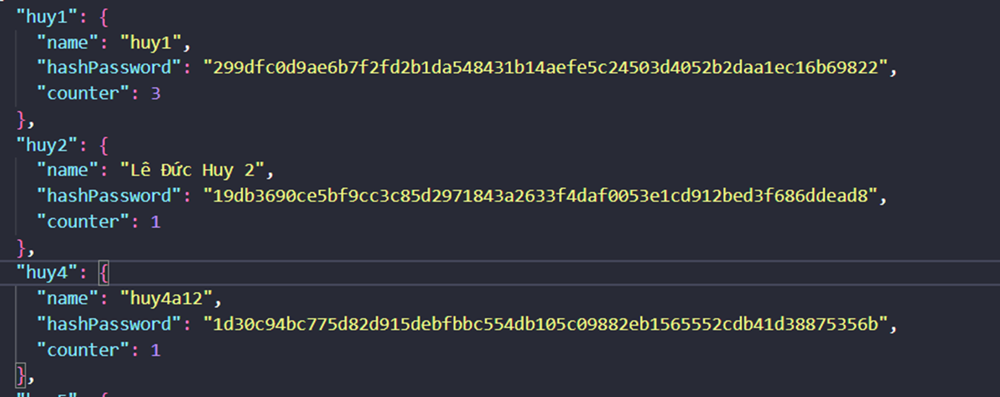
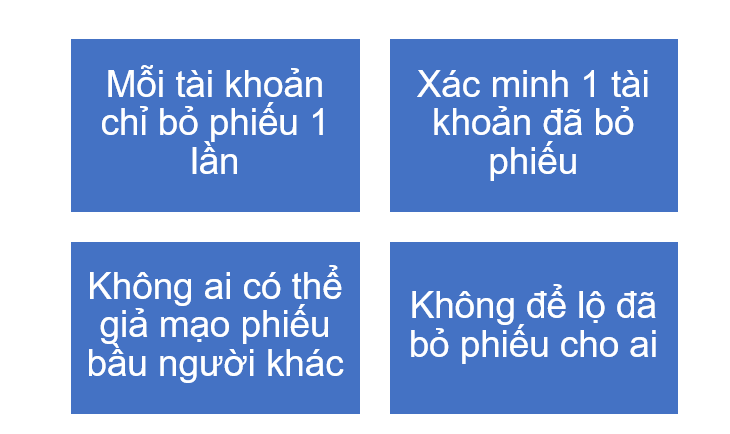

# ZKVote : Website bầu cử bí mật với Zero Knowledge Proof 
ZKVote là một nền tảng bầu cử bí mật sử dụng công nghệ Zero Knowledge Proof đảm bảo tính **bí mật**,  trong quá trình bỏ phiếu. 

## Các chức năng chính của hệ thống 
### Chức năng đăng nhập không tiết lộ password :
- User có thể đăng nhập mà không tiết lộ password với server. 
- Server xác thực user mà không cần lưu password. 
- Sử dụng counter chống replay attack
 

### Chức năng bầu cử bí mật : 
Đảm bảo 4 yêu cầu 

